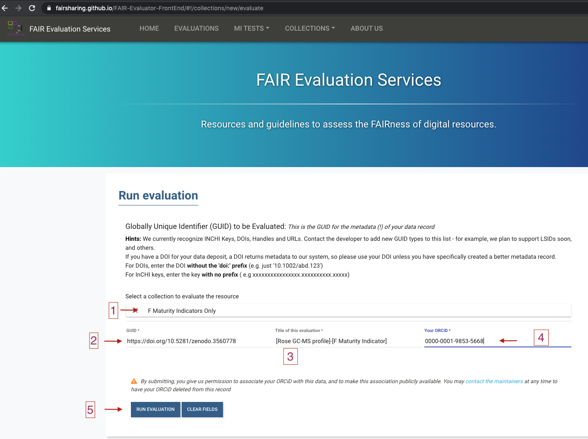
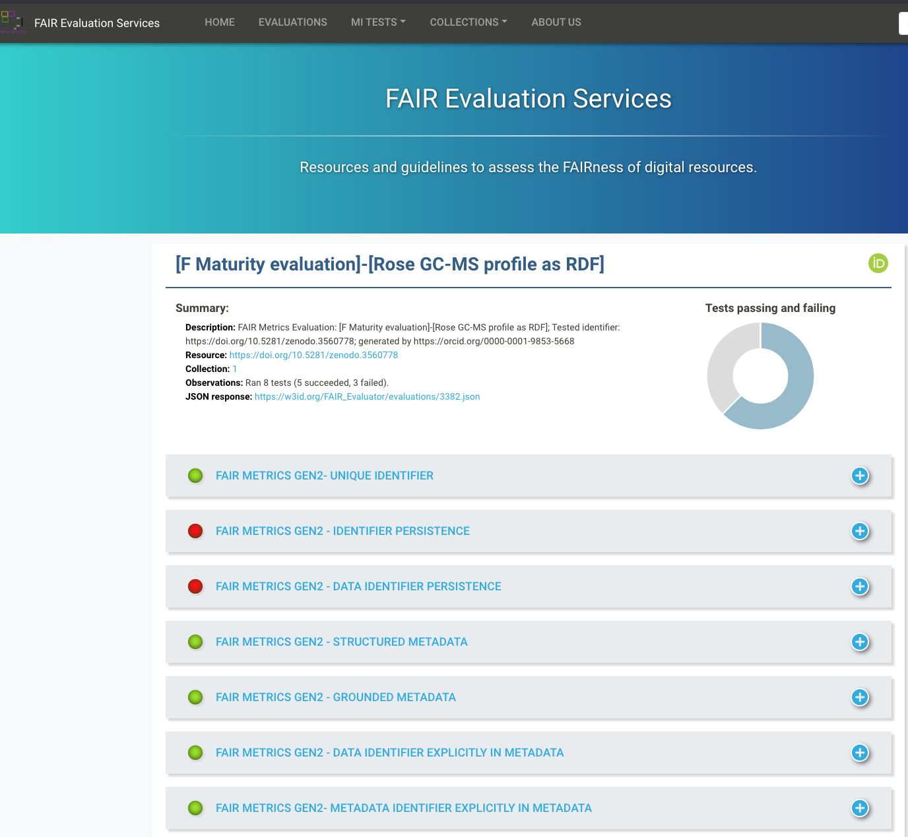

# Recipe1: FAIR Assessment Recipe

**identifier**

**authors**

- [Philippe Rocca-Serra](https://orcid.org/orcid.org/0000-0001-9853-5668)

**maintainers**

- [Philippe Rocca-Serra](https://orcid.org/orcid.org/0000-0001-9853-5668)

**version**

    0.1

**license**

- [CC-BY-4.0](https://creativecommons.org/licenses/by/4.0/)

## Ingredients:

1. Identifier Schema:

- [guidance on persistent resolvable identifiers](https://www.gov.uk/government/publications/open-standards-for-government/persistent-resolvable-identifiers)

- [HTTP1.1 protocol](https://tools.ietf.org/html/rfc2616)

- [Persistent Uniform Resource Locators - PURL](https://archive.org/services/purl/)

- [Archival Resource Key](https://n2t.net/e/ark_ids.html)

- [handle system](http://www.rfc-editor.org/rfc/rfc3650.txt)

- [handle based http proxy for DOI](https://doi.org/)

2. Metadata Model:
- topic dependent

3. Vocabularies and Terminologies:
- topic dependent

4. Data Format:
- [RDF/Linked Data](https://www.w3.org/standards/semanticweb/data)

5. Tools and  Software:

5.1  resolution services:

- [EZID resolution service](https://ezid.cdlib.org/)

- [name2things rsolution service](http://n2t.net/)

- [identifiers.org](https://identifiers.org/)

5.2 FAIR assessment tools

- [FAIREvaluator](https://W3id.org/AmIFAIR)

- [FAIRShake](https://fairshake.cloud/)

        

## Objectives:

Perform an automatic assessment of the status of a dataset with respect to the FAIR principles.
Obtain a machine readable report 

## Step by Step Process:

### Step1: 
     
Navigate the FAIREvaluator tool, which can be accessed via the following 2 addresses:

- [https://w3id.org/AmIFAIR](https://w3id.org/AmIFAIR)

- [https://fairsharing.github.io/FAIR-Evaluator-FrontEnd](https://fairsharing.github.io/FAIR-Evaluator-FrontEnd/#!/#%2F!)

### Step2:

In order the run the FAIREvaluator, it is important to understand to notion of FAIR indicators (formerly referred to as FAIR metrics).
One may browse the list of currently community defined indicators from the `Collections` page 

     

### Step3:

To run an evaluation, the FAIREvaluator needs to following 5 inputs from users:

1. a collection of FAIR indicators, selected from the list described above.
2. a globally unique, persistent, resolveable identifier for the resource to be evaluated.
3. a title for the evaluation. Enforce a naming convention to make future searches easiers as these evaluations are saved.
4. a person identifier in the form of an ORCID

### Step4:

Hit the 'Run Evaluation' button from 'https://fairsharing.github.io/FAIR-Evaluator-FrontEnd/#!/collections/new/evaluate' page

     
### Step5:

Analyze the report:

Time to dig into the details and figure out the reasons why some indicators are reporting a failure:

## Reference:

Wilkinson, M.D., Dumontier, M., Sansone, S. et al. Evaluating FAIR maturity through a scalable, automated, community-governed framework. Sci Data 6, 174 (2019). [doi:10.1038/s41597-019-0184-5](https://doi.org/10.1038/s41597-019-0184-5)

Clarke et al. FAIRshake: Toolkit to Evaluate the FAIRness of Research Digital Resources, Cell Systems (2019),[doi:10.1016/j.cels.2019.09.011](https://doi.org/10.1016/j.cels.2019.09.011)